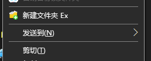
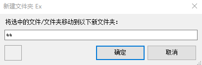

# NFExt （新建文件夹Ex）
New Folder Extension for Windows Explorer

***Public Test 公测阶段***

# How to use

Download the zip file from release section, extract it somewhere you'd like it to stay, then **double click** ```install.bat``` , select yes when asked for administrator privilege, then it's done.

Right click on file / files and you'll see the **New Folder Ex** item in your context menu.


# 如何使用

下载release中的压缩包，解压到一个你想放的位置，然后双击 ```install.bat``` 以管理员身份执行，就可以用了。

现在你可以选中多个文件，点右键，就会出现 **新建文件夹 Ex** 菜单项了。





还不会把 dll 发布到 Microsoft Store， 惭愧。


Merrick Zhang
